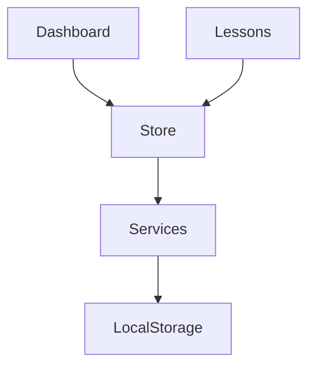

# English Study Pro
## Documento Mestre de Arquitetura, Engenharia e Implementação

Versão: 2.0
Tipo: Documento de referência para IA (Antigravity, Cursor, Claude Code e Copilot)

---

# SUMÁRIO

1. Visão Geral
2. Objetivos do Produto
3. Personas
4. Requisitos Funcionais
5. Requisitos Não Funcionais
6. Arquitetura
7. Estrutura de Pastas
8. Design System
9. Rotas
10. Layouts
11. Componentes
12. Pinia Stores
13. Serviços
14. Persistência LocalStorage
15. Calendário
16. Sistema de Streak
17. Sistema de Conquistas
18. Sistema de Pronúncia
19. Reconhecimento de Voz
20. Estatísticas
21. Exportação
22. PWA
23. Segurança
24. Performance
25. Testes
26. Cronograma das 90 Aulas
27. Diagramas Mermaid
28. Critérios de Aceitação
29. Prompt Mestre para Antigravity

---

# 1. VISÃO GERAL

Aplicação educacional focada em microaprendizado.

Objetivo principal:

Permitir que um estudante brasileiro pratique inglês diariamente durante 90 dias.

Tempo médio:
10 a 15 minutos por dia.

Offline First.

Sem backend.

Persistência 100% local.

---

# 2. PERSONA

Nome: Gabriel

Perfil:

- Desenvolvedor
- Conhece leitura básica
- Possui dificuldade em fala
- Possui dificuldade em compreensão auditiva
- Pouco tempo para estudar

---

# 3. REQUISITOS FUNCIONAIS

RF001 Dashboard

RF002 Plano de 90 aulas

RF003 Calendário

RF004 Registro diário

RF005 Pronúncia

RF006 Reconhecimento de voz

RF007 Conquistas

RF008 Estatísticas

RF009 Exportação PDF

RF010 Exportação JSON

RF011 Modo escuro

RF012 Backup local

---

# 4. ARQUITETURA

Clean Architecture simplificada.

Camadas:

UI
Pages
Components
Stores
Services
Persistence

Fluxo:

View → Store → Service → LocalStorage

---

# 5. ESTRUTURA COMPLETA

src/

assets/
boot/
css/
layouts/
router/
data/
stores/
services/
pages/
components/
composables/
utils/
types/

---

# 6. DESIGN SYSTEM

Tipografia:

- Inter
- Roboto

Cores:

Primary #5E35B1
Secondary #7E57C2
Accent #9575CD
Success #43A047
Warning #FB8C00
Error #E53935

Border Radius:

8px
12px
16px

---

# 7. PÁGINAS

DashboardPage

LessonsPage

LessonDetailPage

StatisticsPage

AchievementsPage

CalendarPage

SettingsPage

AboutPage

---

# 8. COMPONENTES

Dashboard

- ProgressCard
- StreakCard
- NextLessonCard
- DailyGoalCard

Lessons

- LessonCard
- VocabularyCard
- PhraseCard
- ExerciseCard

Calendar

- StudyCalendar

Achievements

- AchievementCard

Settings

- ToggleSetting
- ThemeSelector

---

# 9. STORE STUDY

State

completedLessons
notes
studyDates
streak
totalMinutes
currentLesson

Getters

progress
nextLesson
completedCount
studyDays

Actions

load
save
reset
completeLesson
saveNote
updateStreak

---

# 10. STORE SETTINGS

theme
notifications
speechEnabled
voiceRecognitionEnabled

---

# 11. STORE ACHIEVEMENTS

Achievements:

Primeira Aula

7 Dias

15 Dias

30 Dias

50 Aulas

90 Aulas

---

# 12. SERVIÇOS

speechService

exportService

achievementService

storageService

statisticsService

---

# 13. LOCAL STORAGE

Chave principal:

english-study-app

Modelo:

{
 completedLessons: [],
 notes: {},
 studyDates: [],
 streak: 0,
 achievements: []
}

---

# 14. CALENDÁRIO

Utilizar QDate.

Exibir:

dias estudados

streak

mês atual

---

# 15. SISTEMA DE STREAK

Algoritmo:

Se estudou ontem e hoje:
+1

Se perdeu um dia:
zera

---

# 16. PRONÚNCIA

SpeechSynthesis

Funções:

speak()

pause()

resume()

stop()

---

# 17. RECONHECIMENTO DE VOZ

SpeechRecognition

Fluxo:

captura áudio

transforma em texto

compara

retorna percentual

---

# 18. ALGORITMO DE COMPARAÇÃO

Levenshtein Distance

Escala:

90+ Excelente

80+ Muito Bom

70+ Bom

60+ Regular

---

# 19. ESTATÍSTICAS

Chart.js

Gráficos:

Aulas por semana

Progresso mensal

Dias estudados

Tempo estudado

---

# 20. EXPORTAÇÃO

JSON

PDF

CSV

---

# 21. PWA

Instalável

Offline

Manifest

Service Worker

---

# 22. TESTES

Vitest

Casos:

Store

Components

Services

Speech

Persistence

---

# 23. CRONOGRAMA DAS 90 AULAS

Dias 1-10
Apresentação

Dias 11-20
Família e rotina

Dias 21-30
Casa e compras

Dias 31-40
Trabalho

Dias 41-50
Programação

Dias 51-60
Conversação

Dias 61-70
Viagens

Dias 71-80
Histórias

Dias 81-90
Fluência prática

---

# 24. DIAGRAMA MERMAID

---

# 25. CASOS DE USO

UC01 Concluir Aula

UC02 Registrar Nota

UC03 Ouvir Pronúncia

UC04 Treinar Pronúncia

UC05 Exportar Dados

UC06 Consultar Estatísticas

---

# 26. PERFORMANCE

Lazy Loading

Code Splitting

Pinia Persist

Componentes reutilizáveis

---

# 27. PADRÕES DE CÓDIGO

Composition API

Script Setup

JSDoc

ESLint

Prettier

---

# 28. CRITÉRIOS DE ACEITAÇÃO

100% Responsivo

Offline

Sem backend

90 aulas cadastradas

Pronúncia funcional

Reconhecimento funcional

Exportação funcional

---

# 29. PROMPT MESTRE PARA ANTIGRAVITY

Implemente integralmente o sistema English Study Pro utilizando Vue 3, Quasar Framework, Pinia, Vue Router, Chart.js, jsPDF e Web Speech API.

Utilize arquitetura limpa.

Utilize Composition API.

Crie todos os componentes, páginas, stores, composables e serviços descritos.

Implemente PWA.

Implemente reconhecimento de voz.

Implemente exportação PDF, JSON e CSV.

Implemente testes com Vitest.

Implemente Design System.

Gerar código pronto para produção com alta componentização, documentação JSDoc e padrões modernos de Vue.
